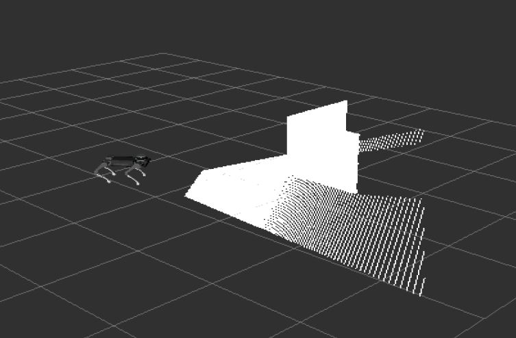
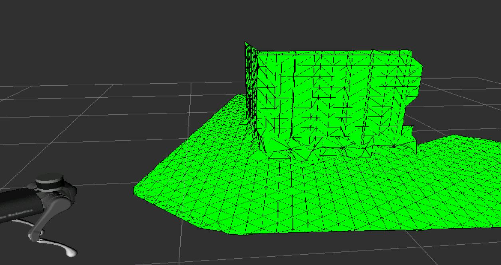

# Traversability module

Slides about the progress can be found a this link:[Presentation](https://docs.google.com/presentation/d/1IzZQCZ4Ff9xYqcYKMeu7aDGVHrLui4tw1DsX4bYEIEQ/edit#slide=id.gcbf566e7df_0_22)  

Tests proposals:[Tests proposal](https://docs.google.com/document/d/19t6lqIYv3lSkReAvJaZ01SKq4jNnmWKGdu48yfn8TtM/edit?usp=sharing)  

Most recent daily blog:[daily blog](https://gitlab.com/Matt98x/Traversability_module/-/blob/main/daily-blogs/April.md)

In this project, we propose a traverability estimation tool for terrestrial robots applications. We generate a map of the environment, simplified in a mesh, and associate to each element a score reprsenting the quality of the interaction with the terrain. Then,this score can be used to make a more informed decision on how to move the robot to traverse the environment.

## Prerequisites

Ubuntu bionic 18.04.5  
ROS Melodic  
A robot with sensors able to extract a point cloud(PointCloud2) and an image of the environment.  
Here an example with the A1 by Unitree:  

 

## Installation and build

## Install 
### From repository
Clone the package into the desired workspace "src" folder or one of its subfolder.
### From source
Download the package from the repository and put it inside the desired workspace "src" folder or one of its subfolder.

## How to use

